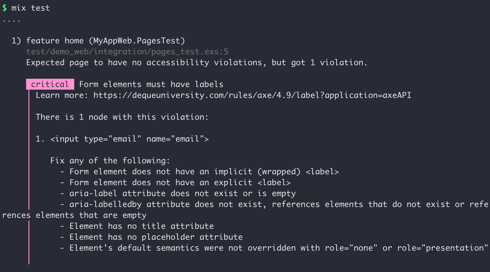

# A11yAudit


Automated accessibility testing for Elixir web applications using [axe-core](https://github.com/dequelabs/axe-core).



## Installation

The library can be installed by adding `a11y_audit` to your list of dependencies in `mix.exs`:

```elixir
def deps do
  [
    {:a11y_audit, "~> 0.3.0", only: :test}
  ]
end
```

## Usage

A11yAudit provides assertions for browser-based tests.

### For Wallaby

Call `A11yAudit.Wallaby.assert_no_violations/1` in your [Wallaby](https://github.com/elixir-wallaby/wallaby) tests.

```elixir
defmodule MyAppWeb.HomeTest do
  use ExUnit.Case, async: true
  use Wallaby.Feature

  feature "home page", %{session: session} do
    session
    |> visit("/")
    |> assert_has(Query.css("h1", text: "My App"))
    |> A11yAudit.Wallaby.assert_no_violations()
  end
end
```

### For Hound

Call `A11yAudit.Hound.assert_no_violations/0` in your [Hound](https://github.com/HashNuke/hound) tests.

```elixir
defmodule MyAppWeb.HomeTest do
  use ExUnit.Case
  use Hound.Helpers

  test "home page" do
    navigate_to("#{MyAppWeb.Endpoint.url()}/")

    heading = find_element(:css, "h1")
    assert inner_text(heading) == "My App"

    A11yAudit.Hound.assert_no_violations()
  end
end
```

### For other environments

If you're running browser-based tests in Elixir without using Wallaby or Hound, you can still use A11yAudit. You will need a way to execute JavaScript snippets, and to get their return values back into your Elixir code. Assuming you have an `execute_script` function that can do that, you can use the test assertions like so:

```elixir
get_audit_result =
  fn ->
    execute_script(A11yAudit.JS.axe_core())
    axe_result_map = execute_script(A11yAudit.JS.await_audit_results())
    A11yAudit.Results.from_json(axe_result_map)
  end

A11yAudit.Assertions.assert_no_violations(get_audit_result.())
```

## Configuration

See the [documentation for `A11yAudit.Assertions.assert_no_violations/1`](https://hexdocs.pm/a11y_audit/A11yAudit.Assertions.html#assert_no_violations/2-options) for a full list of options.

Configuration options can be passed to the assertion functions (`A11yAudit.Wallaby.assert_no_violations/1`, `A11yAudit.Hound.assert_no_violations/0`, `A11yAudit.Assertions.assert_no_violations/1`).

## Supported browsers

Please reference [axe-core's documentation](https://github.com/dequelabs/axe-core?tab=readme-ov-file#supported-browsers) to find out which browsers are supported.

## Checks

Please reference [axe-core's documentation](https://github.com/dequelabs/axe-core/blob/develop/doc/rule-descriptions.md) to find out which accessibility checks are run.

## Caveats

### CSS transitions might cause flaky tests

If the accessibility audit runs while a CSS transition is in progress, it might lead to intermittent failures of the [color contrast](https://dequeuniversity.com/rules/axe/3.5/color-contrast) check. To prevent this, I recommend [turning off CSS transitions in the test environment](https://angelika.me/2024/08/12/how-to-add-css-rules-only-in-test-env-phoenix-app/#what-to-do-instead).
